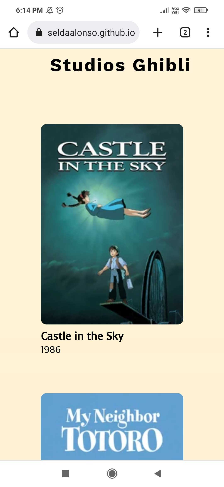

# DataLovers - Studio Ghibli

Para éste desafío se nos propuso hacer una plataforma interactiva para presentar la información de una base de datos, de manera que nuestras usuarias puedan verla, filtrarla y obtener nuevos datos a partir de ella.

## Introducción

Studio Ghibli es un estudio de animación japonés, conocido por sus largometrajes animados como Mi vecino Totoro, El viaje de Chihiro o El castillo ambulante, entre otros grandes éxitos.
Las animaciones tienen gran acogida a nivel mundial y algunas han recibido varias nominaciones y premios. De todo este fandom hay un grupo que desea poder interactuar y ver la información de las animaciones y sus personajes.

## Usuario y Formato

Nuestros usuarios son personas asiduas a la animación y la cultura japonesa, mostrando atracción por los clásicos que construyen éste imaginario. Algunos de ellos son los producidos por el mundialmente famoso Studio Ghibli, temática que abordaremos en nuestro proyecto.

Como formato escogimos una plataforma virtual y responsiva, apta para uso en computador como también en teléfono móvil inteligente.

# HU1

Para nuestras usuarias es importante poder visualizar todas las animaciones de Studio Ghibli en una misma plataforma y cuáles son. Para esto propusimos una interfaz responsiva con tarjetas individuales para cada una de las películas del estudio

[pantallazo primera maqueta en figma]
[pantallazo primer prototipo testeable y desplegado en GitHub Pages]

## Primeros testeos y feedback de usuarias
## Conclusiones y desiciones de rediseño

[pantallazo interfaz con cambios]

# HU2

Para nuestras usuarias es necesario poder buscar dentro de las tarjetas la película que desean según su nombre. Para esto agregamos un buscador interno mediante un input, que filtra los resultados incluyendo coincidencias del texto ingresado.

[pantallazo primera maqueta en figma]
[pantallazo primer prototipo testeable y desplegado en GitHub Pages]

## Primeros testeos y feedback de usuarias
## Conclusiones y desiciones de rediseño

[pantallazo interfaz con cambios]

# HU3

Nuestras usuarias tienen la necesidad de poder ordenar las animaciones según año de estreno, de manera ascendente y descendente. Así mismo necesitan filtrar las películas según su director. Para esto proponemos agregar una barra con selectores, donde la usuaria pueda elegir el criterio de orden y filtrado de las tarjetas dentro de la plataforma. Nuestras usuarias también quieren conocer cuántas películas coinciden con sus filtros de busqueda.Para lograrlo, agregaremos un contador bajo la barra de menú, que indique la cantidad de películas mostradas en pantalla.

pantallazo primera maqueta en figma]
[pantallazo primer prototipo testeable y desplegado en GitHub Pages]

## Primeros testeos y feedback de usuarias
## Conclusiones y desiciones de rediseño

[pantallazo interfaz con cambios]

# HU4

Nuestras usuarias quieren conocer más información de cada una de las películas: sinopsis, RT score, director y productor. Para lograrlo, agregaremos modal, que muestre la información extra al hacer click en las tarjetas de películas.

pantallazo primera maqueta en figma]
[pantallazo primer prototipo testeable y desplegado en GitHub Pages]

## Primeros testeos y feedback de usuarias
## Conclusiones y desiciones de rediseño

[pantallazo interfaz con cambios]

## Enlace

Para visitar el resultado final de nuestro proyecto Data Lovers puedes seguir el siguiente enlace

[enlace a la pagina desplegada en GitHub Pages]

